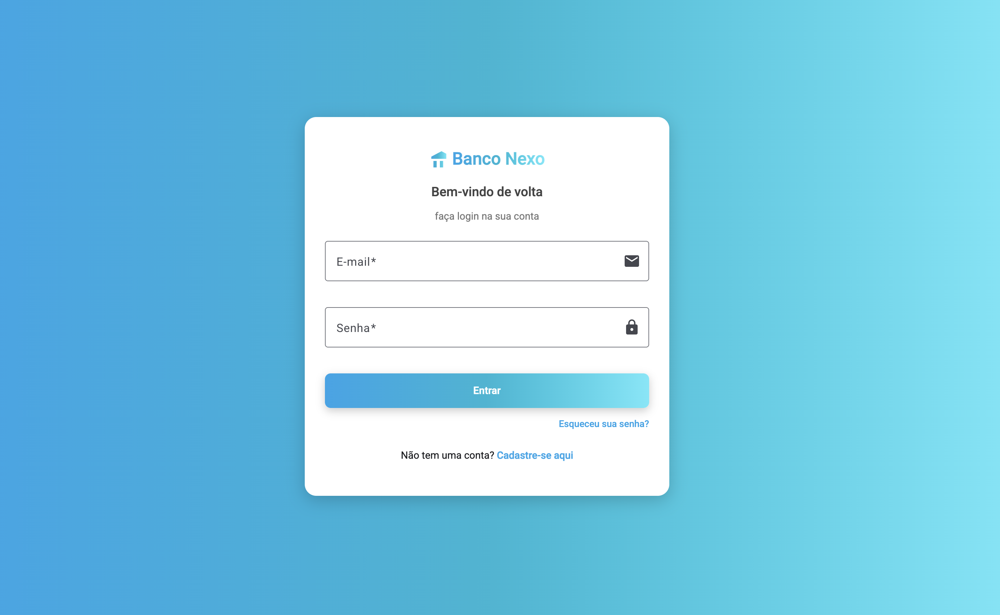
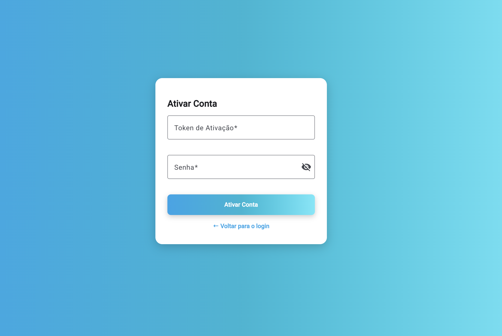
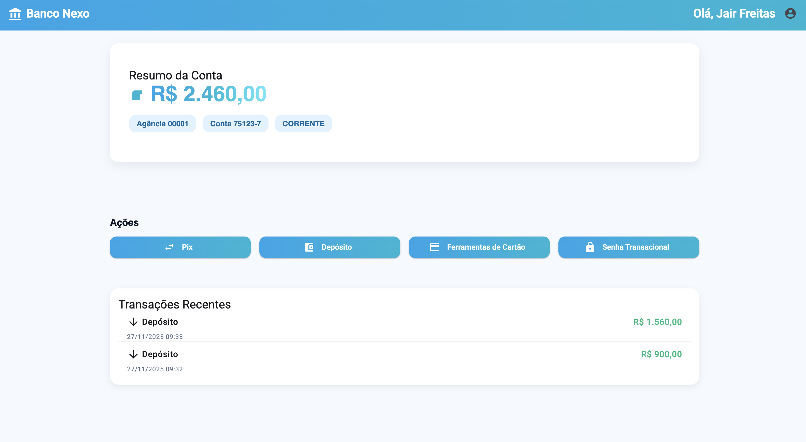
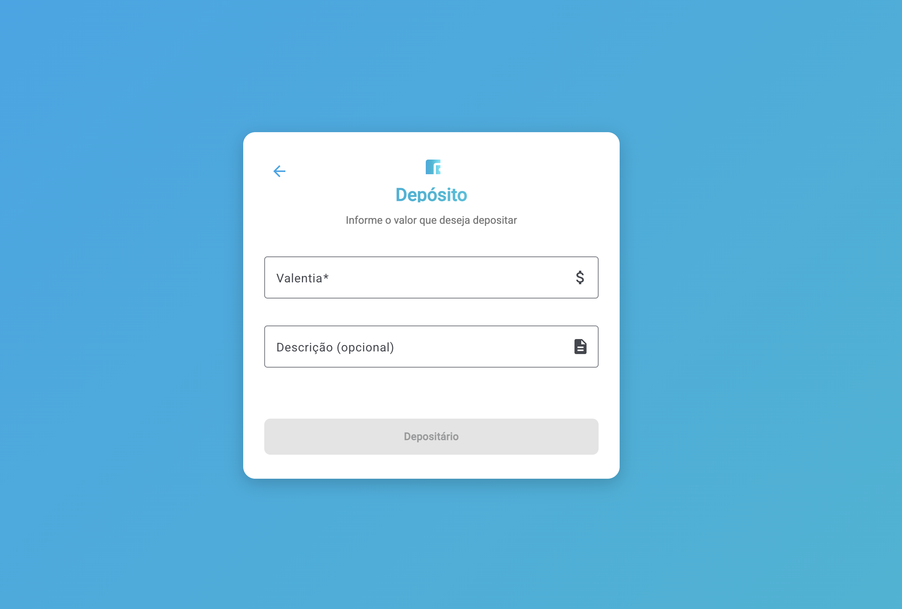
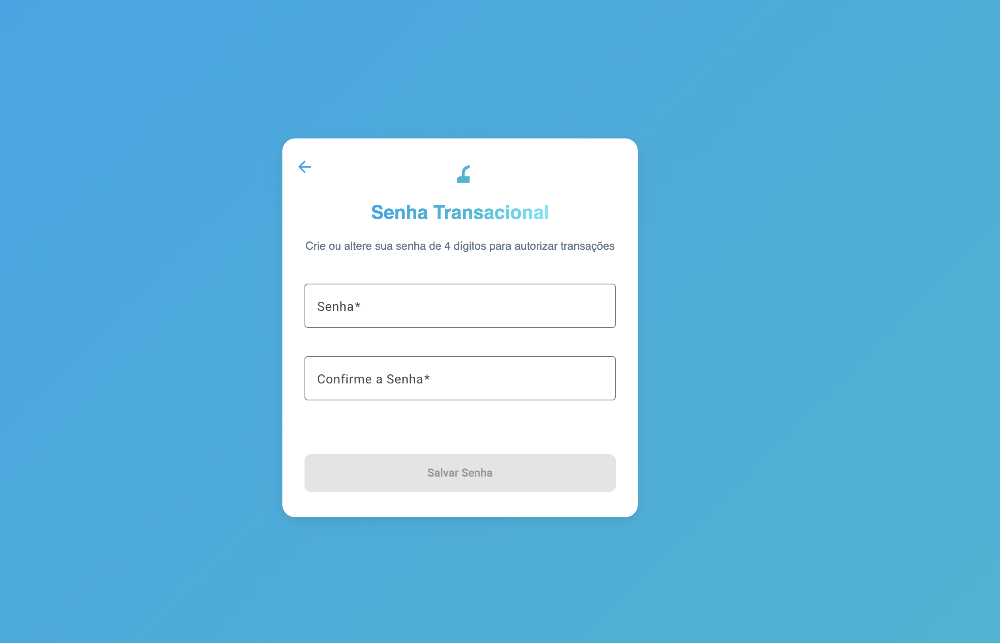
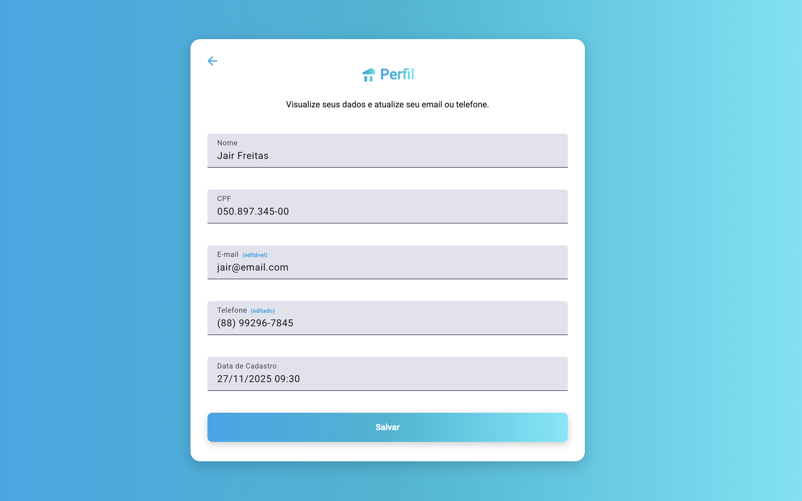
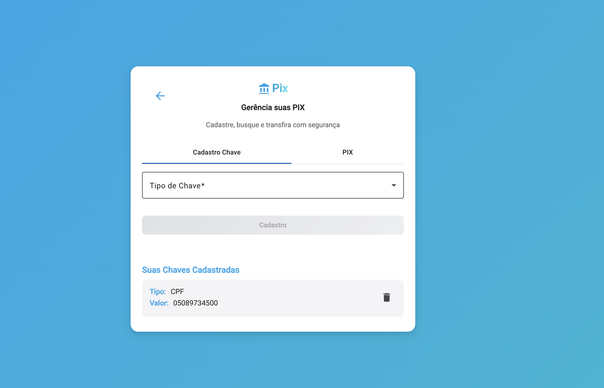
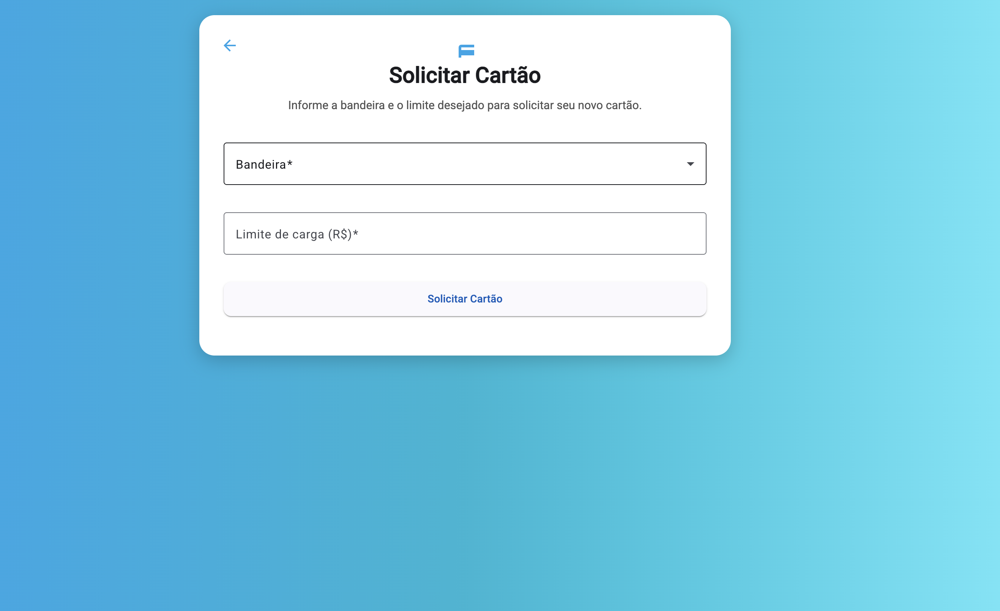

# 🏦 **Banco Nexo — Sistema Bancário Digital Distribuído**

```
██████╗  █████╗ ███╗   ██╗ ██████╗ ██████╗     ███╗   ██╗███████╗██╗  ██╗ ██████╗ 
██╔══██╗██╔══██╗████╗  ██║██╔════╝ ██╔══██╗    ████╗  ██║██╔════╝██║  ██║██╔═══██╗
██████╔╝███████║██╔██╗ ██║██║  ███╗██████╔╝    ██╔██╗ ██║█████╗  ███████║██║   ██║
██╔═══╝ ██╔══██║██║╚██╗██║██║   ██║██╔══██╗    ██║╚██╗██║██╔══╝  ██╔══██║██║   ██║
██║     ██║  ██║██║ ╚████║╚██████╔╝██║  ██║    ██║ ╚████║███████╗██║  ██║╚██████╔╝
╚═╝     ╚═╝  ╚═╝╚═╝  ╚═══╝ ╚═════╝ ╚═╝  ╚═╝    ╚═╝  ╚═══╝╚══════╝╚═╝  ╚═╝ ╚═════╝ 
```

<p align="center">
  
  
  
  
  
  
  
</p>

---

# 📌 **Visão Geral**

O **Banco Nexo** é um sistema bancário digital completo, desenvolvido com microsserviços Spring Boot, arquitetura orientada a eventos (Kafka), autenticação JWT e frontend Angular.

### Recursos:
✔ Login + autenticação JWT  
✔ Cadastro de usuários  
✔ Ativação de conta  
✔ Dashboard com saldo e histórico  
✔ Depósitos  
✔ PIX (transferência)  
✔ Cadastro de chaves PIX  
✔ Senha transacional  
✔ Solicitação de cartão  
✔ Perfil do usuário  
✔ Eventos assíncronos via Kafka  

---

# 🧩 **Arquitetura Completa**

```
                          ┌──────────────────────────┐
                          │        Angular SPA       │
                          │  (web-banking frontend)  │
                          └─────────────┬────────────┘
                                        │ HTTP
                                        ▼
                              ┌──────────────────┐
                              │   API Gateway    │
                              │ JWT | Routing | CORS │
                              └─────────┬────────┘
                       ┌────────────────┼──────────────────┐
                       ▼                ▼                  ▼
             ┌────────────────┐ ┌────────────────┐ ┌───────────────────┐
             │ Auth Service   │ │ User Service   │ │ Account Service   │
             │ Login/JWT      │ │ CRUD usuário   │ │ PIX / Depósitos   │
             └────────────────┘ └────────────────┘ └───────────────────┘
                       │                │                  │
                       └─────── Kafka Topics (Events) ─────┘
                                     user-events
                                     user-updated-events
                                     account-events
```

---

# 🚀 **Como Executar (SEM DOCKER!)**

Você rodará **cada microsserviço manualmente**.

---

## 1️⃣ Clonar o projeto

```bash
git clone [https://github.com/seu-usuario/banco-nexo.git](https://github.com/jairft/Bank-service)
cd banco-nexo
```

---

# 2️⃣ Subir o Kafka manualmente

Você precisa ter **Kafka + Zookeeper** instalados localmente.

### Start Zookeeper:

```bash
zookeeper-server-start.sh config/zookeeper.properties
```

### Start Kafka:

```bash
kafka-server-start.sh config/server.properties
```

---

# 3️⃣ Criar os tópicos necessários

```bash
kafka-topics.sh --create --topic user-events --bootstrap-server localhost:9092
kafka-topics.sh --create --topic user-updated-events --bootstrap-server localhost:9092
kafka-topics.sh --create --topic account-events --bootstrap-server localhost:9092
```

---

# 4️⃣ Executar cada serviço Spring Boot

Em terminais separados:

### Eureka Server:

```bash
cd eureka-server
./mvnw spring-boot:run
```

### API Gateway:

```bash
cd api-gateway
./mvnw spring-boot:run
```

### Auth Service:

```bash
cd auth-service
./mvnw spring-boot:run
```

### User Service:

```bash
cd user-service
./mvnw spring-boot:run
```

### Account Service:

```bash
cd account-service
./mvnw spring-boot:run
```

---

# 5️⃣ Rodar o Frontend Angular

```bash
cd web-banking
npm install
ng serve
```

Acesse:  
👉 **http://localhost:4200**

---

# 🔐 **Segurança**

✔ JWT Bearer protegido no Gateway  
✔ BCrypt para senhas  
✔ Senha transacional obrigatória  
✔ Logs centralizados  
✔ Eventos críticos feitos via Kafka  

---

# 🖼️ **Screenshots da Aplicação**

> Coloque suas imagens nesta pasta:  
📁 **docs/screenshots/**


| Tela | Imagem |
|------|--------|
| Login |  |
| Ativação |  |
| Dashboard |  |
| Depósito |  |
| Senha Transacional |  |
| Perfil |  |
| Chaves PIX |  |
| Cartão |  |

---

# 🧬 **Estrutura do Repositório**

```
/banco-nexo
   /api-gateway
   /eureka-server
   /auth-service
   /user-service
   /account-service
   /web-banking
   /docs
      /screenshots
   README.md
```

---

# 📜 **Roadmap**

- [ ] Testes unitários JUnit  
- [ ] Testes integrados dos serviços  
- [ ] Métricas com Spring Actuator  
- [ ] Logs distribuídos com ELK  
- [ ] UI para admin  
- [ ] WebSocket para atualizações de saldo  

---

# 👤 **Autor**

Feito com 💜 por **Jair Freitas**.  
Se quiser melhorar este projeto, pull requests são bem-vindos!

---

